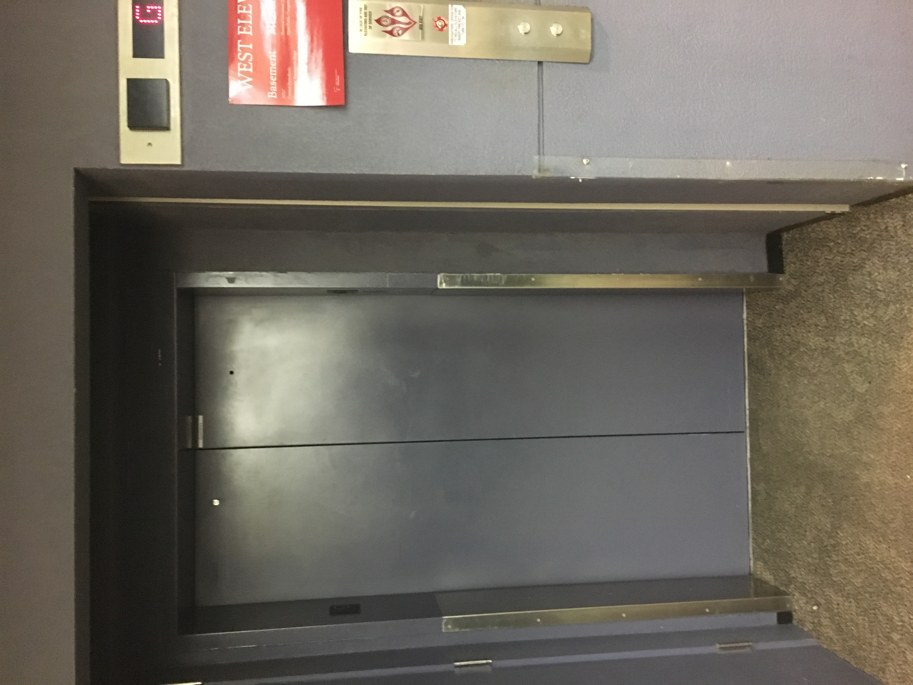

# Elevator Interface Report

This project is to analyze an elevator interface and modify it for easier use

## Elevator Location

The elevator is located in the TTU Library. This is the elevator that takes a person

## Control Interface

#

## Design Issues

- The elevators are far apart from each other
- Does not indicate what floor the elevator is on
- Puzzling floor indicators
- Some of the emergency info is missing
- There is only a small dot in the middle that lights up if someone has pushed it

## Why design is bad

- The elevators are not only far from each other, they are also pushed into the wall. Sometimes when you are standing on one side waiting for an elevator, it is sometimes easy to not realize that an elevator has opened its doors and for you to miss it.
- The floor numbers are vary confusing to use at first. The first floor is called ground floor. But after that there is a mezzanine floor (M button). Then there are the stack floors 1 to 5. It is hard to understand what florr one has to go to when they first see this elevator
- The elevator also does give any major support to disable people
- The elevator is not optimized. It goes to the floors by who slected it first. This is the best because the elevators does not know what floor the user wants to go when the floor is selected, so it cannot be optimised

## Common and Rare Uses

### Common

- Move between floors
- Press the correct floor button
- Wait for the elevator to come to your floor

### Rare

- Firefighters to get to a certain floor quickly
- Call 911

## Common Sequence of Actions

1. Find the elevator outdoor panel
2. Select if the person wants to go up or down
3. Once the elevator arrives, the user boards the elevator
4. The user selects a floor
5. The user reaches his desired floor
6. The user steps out and walks away

## Elevator Feedback

- The elevator at the library does not give any major forms of feed back. One has to just notice the arrow keys at the top to see if the elevator is going up or down.

## Suggested Improvements

- Move the elevators closer together
- Create a floor indicator on the top
- Have up and down arrows next to the floor indicator that lights up when the door open so the user can know if the elevator is going up or down
- Redesign the floors to be regular. The could go from 1 to 6
- Have the floor selector panel outside. This iformation can be used to optimize the elevator's path so users are served faster. This can also be used in more complex ways in situations where there are a lot more that 5 floors where an app can built where a user selects the floor from his app and the app gives the user an ETA on when the elevator can be there

## Suggested Sketch

## My Demo

[Demo Link](https://xd.adobe.com/spec/e886daa4-75bb-448f-781f-6445a1898cca-9eb7/)

## Extra Credit Suggestion

- To help disabled people, a suggestion for blind people is to make the entire process voice activated i.e. The elevator can announce which way it is going, when the doors are opened etc. We can also use the voice recognition outsite to ask the user what floor they want to go to. There can be a camera upfront scanning to see if there is an individual waiting for an elevator so the computer knows when to ask the question.
